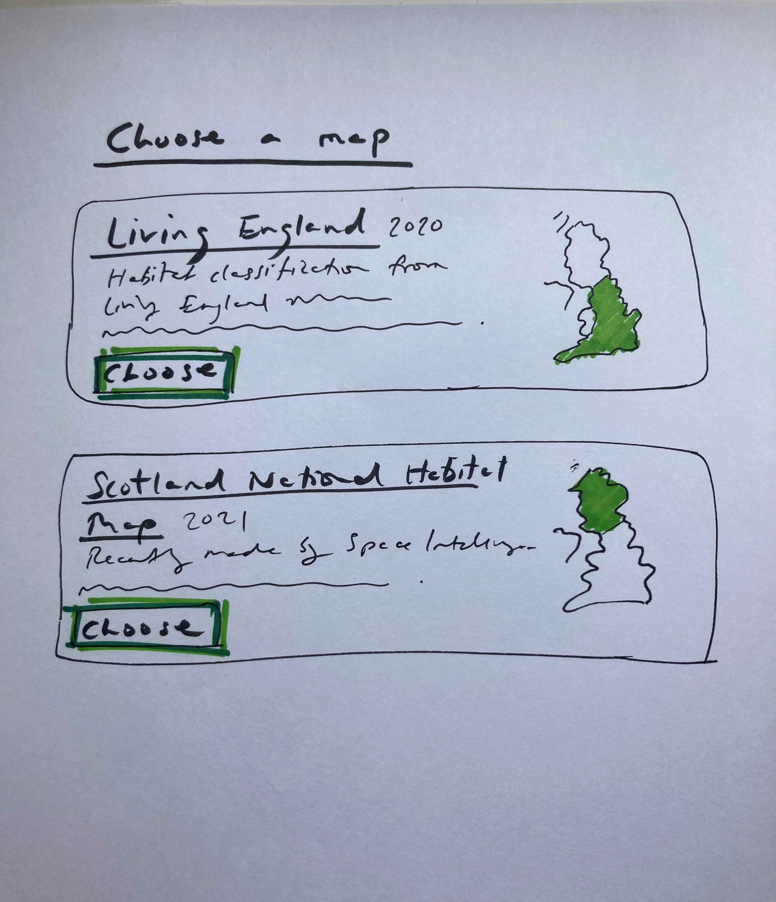
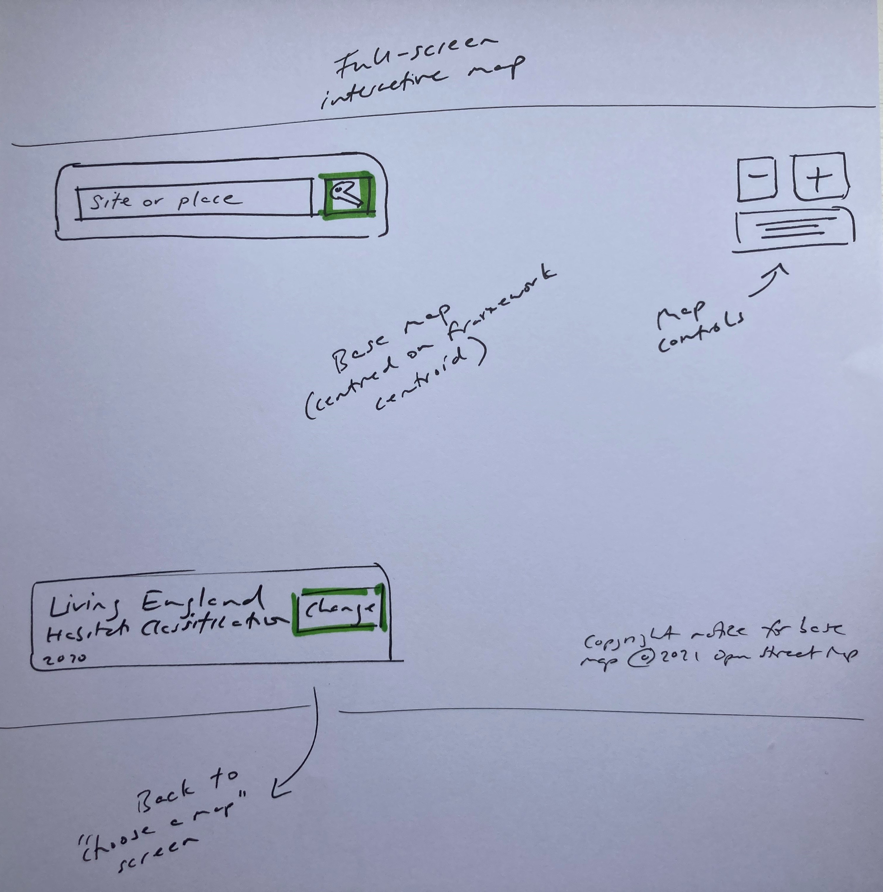
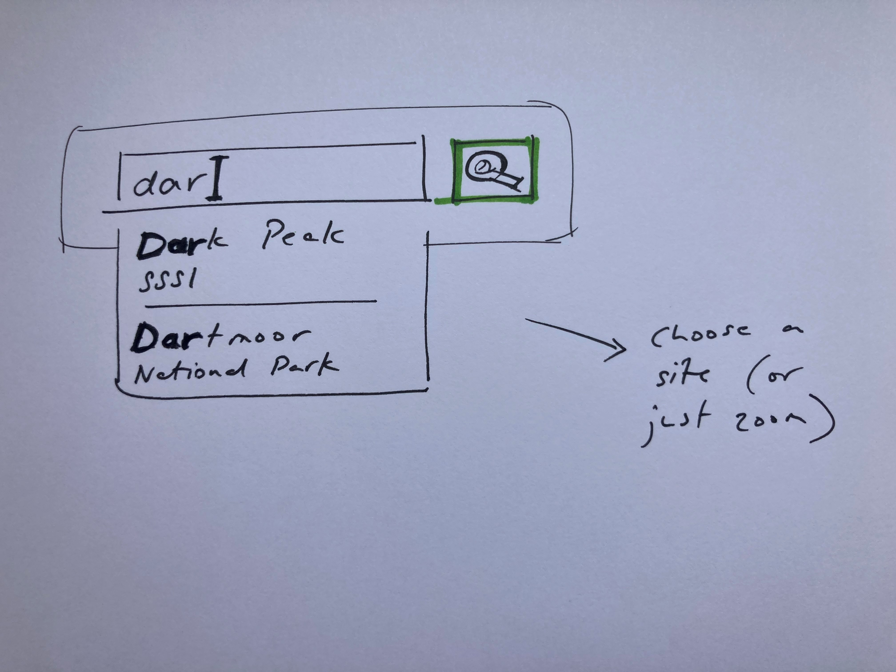
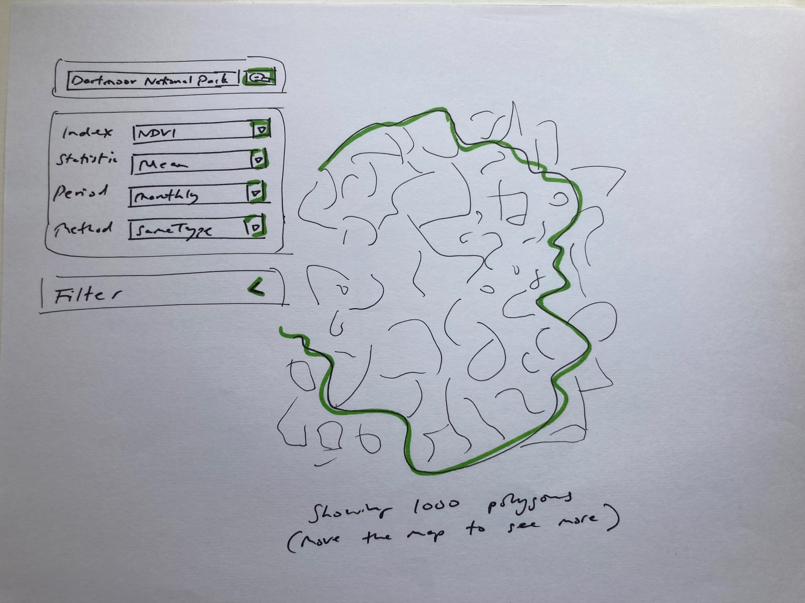
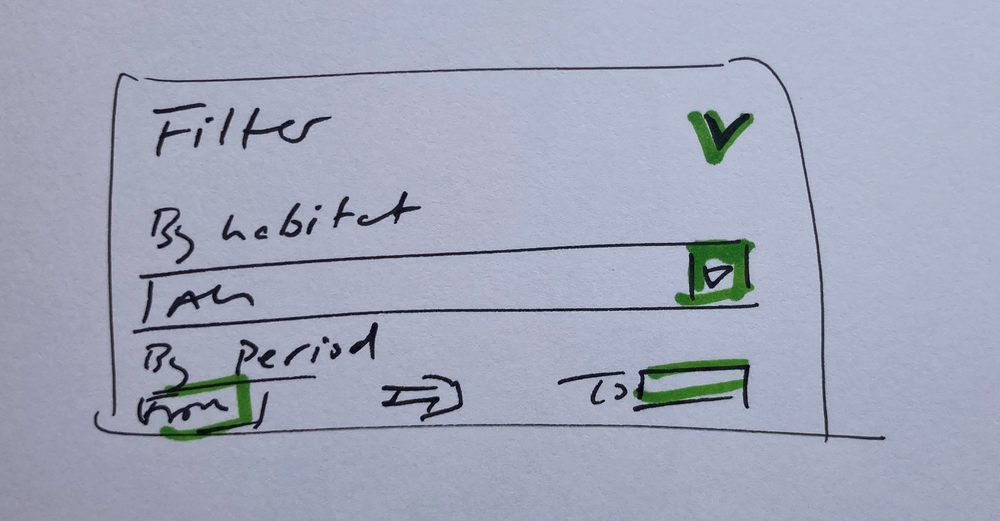

Wireframes
==========

Choose a map
---------------

The standard home page 'Get started' button takes us to the "Choose a map" screen. This is a choice about which habitat map (spatial framework) use.

Each map has a title and some explanatory information about who created them and how they were made. (We could also add logos, and copyright information and other value-adding information from the providers of the frameworks.)

Note that each map has a stylized thumbnail indicating the coverage of the map.

Forcing the user to explicitly engage with the habitat maps choice has a number of advantages, including:

- explaning conceptually what the app does
- grounding the user in the science of the app
- removing the issues of unexplained borders (where the app "doesn't work" over a country border)

 Presently, we are expecting a handful of different habitat maps. This design allows for expansion; as more habitat maps (spatial frameworks) are added or versioned, we can add filtering and grouping or even searching to this screen.

Full-screen map
---------------

Choosing a habitat map takes us immediately to the full-screen, interactive map which is the main screen of the application.

The map will be centred on the centroid of the chosen habitat map. The chosen habitat map is shown in the bottom left with a route to return to the "Choose map" screen.

The map will be fairly zoomed out; in the case of an England map, the user will be able to see the majority of the country (depending on her screen resolution) and the boundary of the habitat map (in this case, England).

The sole focus at this point is the search box, which will have the input focus and prompt the user to type a 'Site or place'.  

Search box (gazetteer)
----------------------

The search box will be familiar to the user from Google Maps. Simply type, and we suggest places that you might mean.

We will make a custom gazetteer focussed on the types of sites and areas in which our specialist user is likely to be interested. We will make a database of

- SSSIs
- National Parks
- TODO which others?

When a place is chosen, the map will move to the appropriate area and zoom level, and display the boundary of the place in the viewport.

Alternatively, the user can simply zoom in to *any* area in the world. This is likely to be discovered as a user learns to use the app. It is important to note that the gazetteer is an orthogonal feature and does not relate to or depend on any other data in the app - it is merely a convenience to get oneself to a particular coordinate and zoom level, and a useful visual guide.

Polygons
--------

Once a threshold zoom level is reached, we start to display polygons.

Filter
--------

The filter is an "advanced" user-case, so we collapse initally.

Polygon statistics
-------------------

The app from this point works similarly to the existing pilot app. See https://jncc.shinyapps.io/CUULandscapeMonitoring/
